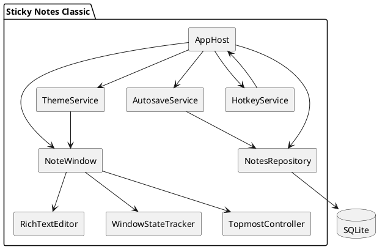
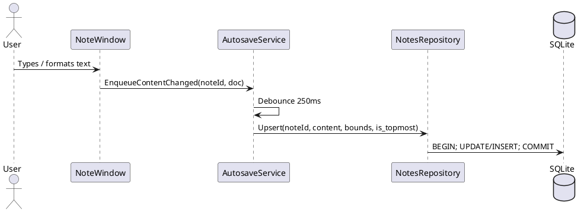
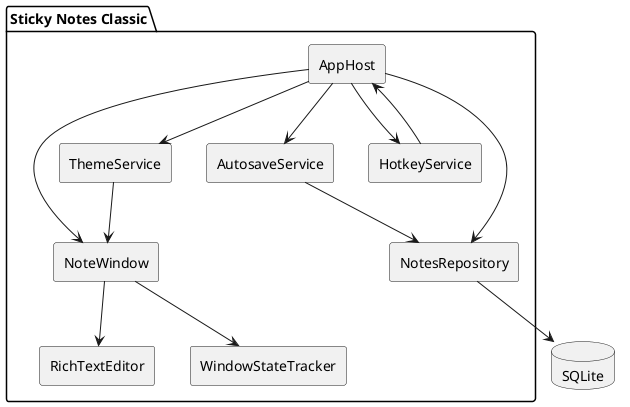
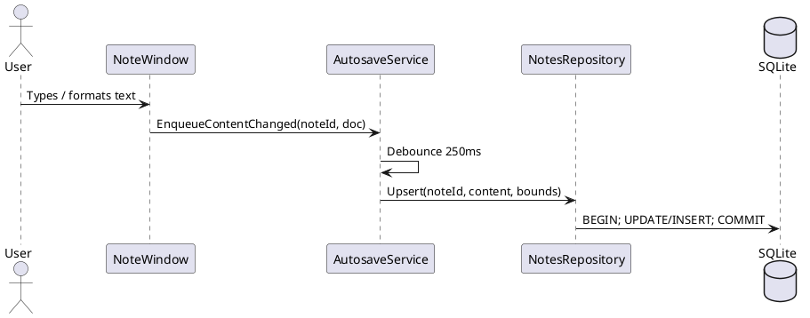

# SPEC-001-Sticky Notes Classic (.NET 9, cross-platform)

## Background

Microsoft’s **Sticky Notes (Windows 7 era)** is remembered for being instant-launch, visually “paper-like”, and frictionless: each note is its own lightweight window; text wraps; formatting is via simple shortcuts; and everything auto-persists (position, size, color, content) without an explicit “save”. The goal is a **lightweight, snappy**, cross-platform clone that matches the **visual appearance and core behavior** of the classic Windows 7 Sticky Notes.

Assumptions (explicit):
- We clone **Windows 7 Sticky Notes UX**, not the newer Windows 10/11 “Sticky Notes” (which includes lists/sync/search).
- **Local-only persistence** (no cloud sync) for MVP.
- Primary target: Windows/macOS/Linux desktop with **one codebase**.

## Requirements

### Must have
- Create multiple notes; each note is a separate always-available window.
- Note UI closely matches classic Windows 7 Sticky Notes look (paper background, header strip with icons, subtle border/shadow).
- Edit text with word-wrap; newline support.
- **Full formatting parity (MVP):** implement the classic Sticky Notes keyboard shortcuts as completely as feasible:
  - Toggle **Bold/Italic/Underline/Strikethrough**
  - **Bulleted list** toggle
  - **Increase/Decrease font size**
  - Standard edit shortcuts: undo/redo, cut/copy/paste, select all
- Per-note color themes matching classic palette (at minimum: Yellow, Green, Pink, Blue, Purple, White).
- Resize notes; drag to reposition; z-order behavior that feels like “sticky on desktop”.
- Auto-save with crash-safety: content + formatting + window bounds persist frequently (debounced) and on close.
- Close (delete) note with confirmation consistent with classic behavior.
- Startup restores all notes in their previous positions/sizes/colors.
- Runs on Windows/macOS/Linux using .NET 9 runtime.
- **Per-note “Always on top” toggle** (persisted).

### Should have
- **System-wide global hotkey** (configurable) to create a new note, even when the app is not focused.
- “New note” action available from any existing note (plus icon in header) and via menu/shortcut.
- Import/export notes (JSON backup) and automatic daily backup retention.

### Could have
- Search across notes.
- Note pinning/grouping.
- Markdown export.

- Search across notes.
- Note pinning/grouping.
- Markdown export.

### Won’t have (MVP)
- Microsoft account sync / OneNote integration.
- Collaboration.
- Mobile.

## Method

### Technology choices
- UI framework: Avalonia UI (cross-platform, production-ready, single XAML codebase).
- Target framework: `net9.0`.
- Rich text editor: Avalonia does not ship a first-party `RichTextBox`; use **Simplecto.Avalonia.RichTextBox** (or an internal fork) to support formatting shortcuts and styled ranges.
- Persistence: SQLite (`Microsoft.Data.Sqlite`) + lightweight schema; WAL mode for robustness.
- Packaging:
  - Windows: MSIX or Squirrel.Windows
  - macOS: `.app` + notarized DMG
  - Linux: AppImage + optional deb/rpm

### Architecture

**Window strategy (MVP): one process, one window per note**
- Each note is a distinct `NoteWindow` instance.
- The app has no main “dashboard” window; closing the last note triggers app exit (configurable later).
- A lightweight `AppHost` keeps shared services alive (repository, autosave queue, hotkey).

Key goals: fast startup, minimal allocations, and predictable latency.

- UI process contains:
  - `NoteWindow` (one per note)
  - `NotesRepository` (SQLite)
  - `AutosaveService` (debounced flush)
  - `ThemeService` (palette + styles)
  - `HotkeyService` (platform-specific adapter)

#### Component diagram (PlantUML)



#### Data model

**Document storage choice (MVP): RTF**
- Store formatted content as **RTF** in `content_rtf`.
- Maintain `content_text` as a plain-text cache for fast indexing/search (even if search is post-MVP).
- Version future-proofing: prepend a short header marker if needed (e.g., `SNCRTF1:`) so we can migrate later without ambiguity.

**Font behavior (MVP): configurable**
- Provide a **global font selector** (Settings) that affects newly created notes and optionally “apply to all”.
- Still support classic shortcuts to increase/decrease font size within the note.

**SQLite schema (v1)**

```sql
CREATE TABLE notes (
  id            TEXT PRIMARY KEY,
  created_utc   TEXT NOT NULL,
  updated_utc   TEXT NOT NULL,

  color         INTEGER NOT NULL,          -- enum palette
  is_topmost    INTEGER NOT NULL DEFAULT 0,

  x             REAL NOT NULL,
  y             REAL NOT NULL,
  width         REAL NOT NULL,
  height        REAL NOT NULL,

  content_rtf   TEXT NOT NULL,
  content_text  TEXT NOT NULL,

  is_deleted    INTEGER NOT NULL DEFAULT 0
);

CREATE INDEX idx_notes_updated ON notes(updated_utc);
CREATE INDEX idx_notes_deleted ON notes(is_deleted);
```

#### Note behavior details (Windows 7 parity)

- Header strip: shows title (“Sticky Note”/“New Note”) and icons:
  - **+** create new note
  - **X** delete/close note
  - **Pin** (or similar) to toggle **Always on top**
- Context menu on note body: Cut/Copy/Paste/Delete/Select All and Color picker.
- Auto-grow (optional): classic behavior often grows height when lines exceed; implement “auto-grow until max-height” to feel similar.
- Keyboard shortcuts: implement the full formatting set (bold/italic/underline/strikethrough, bullets, font size +/-) plus standard editing commands.

#### Autosave algorithm

- Every edit triggers a debounced save:
  - 250ms after last keystroke OR immediately on window deactivation/close.
- Window move/resize triggers a throttled save:
  - 200ms after last drag/resize event.
- Topmost/color changes save immediately.
- Writes are batched on a single background task queue.

Sequence (PlantUML):



### Cross-platform UX constraints

- Windows 7 exact window chrome is not portable. We will mimic it by:
  - Borderless window + custom-drawn header strip (Avalonia templates)
  - Drop shadow via platform effects where supported
- Window behaviors (per-platform caveats):
  - **Always-on-top:** toggle uses the platform topmost hint exposed by Avalonia; persisted per note.
  - **Taskbar/dock:** each note window appears as a normal app window; post-MVP we can offer a “single taskbar icon” mode if desired.
  - **Window restore:** bounds are persisted; on restore, clamp to the current monitor work-area to avoid off-screen notes.
- System integration differences:
  - **System-wide hotkey:** OS-specific implementations behind `HotkeyService`.
  - “Start with OS” optional (post-MVP): Windows registry / macOS login items / Linux autostart.

### Similar applications (reference for behavior)
- Windows 7 Sticky Notes (target behavior).
- 7 Sticky Notes / Simple Sticky Notes (feature-adjacent inspiration for menus + palettes).

### UI spec (Windows 7 classic visual tokens)

Because Windows 7’s exact chrome metrics depend on **system DPI, theme, and font rendering**, we define the UI in **device-independent pixels (DIP)** with a dedicated `ClassicTokens` object so contractors can **tune** the last 5–10% via screenshot comparisons.

#### Typography
- Default font family: **Segoe Print** (fallbacks: `Segoe UI`, `Comic Sans MS`, `Sans-Serif`). The Win7 Sticky Notes default is widely reported as Segoe Print. ([superuser.com](https://superuser.com/questions/35589/how-do-i-change-the-default-font-of-sticky-notes?utm_source=chatgpt.com))
- Default font size: **12 DIP** (tunable).
- Line height: **1.25**.

#### Window + layout metrics (DIP)
- Note min size: **(W=140, H=120)**; default initial size **(W=220, H=200)**.
- Outer corner radius: **4**.
- Border thickness: **1** (semi-transparent).
- Drop shadow: **radius 10, offset (0, 3), opacity 0.25** (tunable per platform).

Header strip
- Header height: **24**.
- Header padding: **Left 8, Right 6, Top 4, Bottom 4**.
- Header title text: `Sticky Notes` (optional; can be blank to match the classic minimal header feel).

Icons (top-right)
- Icon size: **16x16**.
- Icon hit target: **22x22**.
- Icon spacing: **4**.
- Order (right to left): **Close (X)**, **New (+)**, **Topmost (Pin)**.

Editor (body)
- Body padding: **10** (all sides).
- Selection highlight: use system selection color (do not hardcode).
- Scrollbars: hidden by default; appear only when content exceeds maximum growth (if auto-grow is capped).

Resize affordance
- Bottom-right “grip”: subtle diagonal dots (optional, can be emulated with a small vector pattern).

#### Color palette
Windows 7 Sticky Notes exposes: **Blue, Green, Pink, Purple, White, Yellow**. ([sevenforums.com](https://www.sevenforums.com/tutorials/6278-sticky-notes-change-color.html?utm_source=chatgpt.com))

For pixel-accurate look, we define per-color **base fill**, **top highlight**, and **border**.
These are *tunable* and start from common “sticky note” palette approximations:

| Theme | Fill (base) | Fill (top highlight) | Border |
|---|---:|---:|---:|
| Yellow | `#FEFF9C` | `#FFFCE0` | `#D6D37A` |
| Blue | `#7AFCFF` | `#DFFBFF` | `#6BC9CC` |
| Pink | `#FF7EB9` | `#FFE0EF` | `#D46A97` |
| Green | `#B8FF9C` | `#E6FFE0` | `#86C26F` |
| Purple | `#C5B3FF` | `#EEE8FF` | `#9A88D6` |
| White | `#FFFFFF` | `#FFFFFF` | `#CFCFCF` |

Seed palette reference used for initial values (tune to match Win7 screenshots): ([color-hex.com](https://www.color-hex.com/color-palette/29241?utm_source=chatgpt.com))

#### Assets
- Prefer vector icons (X, +, pin) drawn in XAML to avoid platform raster differences.
- Optional subtle “paper noise” overlay (2–3% opacity) applied to the body only.

#### Visual parity workflow (contractor-ready)
- Create a `ClassicTokens.json` file with all values above.
- Provide a “Visual Debug” mode that overlays measurements (header bounds, padding guides) and allows hot-reloading tokens.
- Validate against a small set of reference screenshots and adjust tokens until within acceptable delta.

## Implementation

### 1) Project setup
- Repo structure:
  - `src/StickyNotesClassic.App` (Avalonia desktop app)
  - `src/StickyNotesClassic.Core` (domain + persistence)
  - `src/StickyNotesClassic.Tests`
- CI: GitHub Actions build matrix (win/mac/linux), run unit tests, produce artifacts.

### 2) Settings (global font)
- Add lightweight Settings window (or flyout) containing:
  - Default font family (dropdown)
  - Default font size (number/stepper)
  - Option: “Apply default font to all existing notes” (one-time bulk update)
- Persist settings in a simple `settings` table (SQLite) or `settings.json` (recommended: SQLite to keep everything in one place).

### 3) UI foundation (visual parity) (visual parity)
- Build `NoteWindow` with:
  - Borderless window
  - Custom header strip with +, X, and **Topmost toggle** icon
  - Body with RichText editor control
  - Context menu and color picker
- Create a `ClassicTheme.axaml` implementing:
  - Note background gradients, subtle noise texture (optional), fonts, padding
  - Palette mapping
- Snapshot-testing on Windows + pixel-diff tolerance (optional) to keep visuals stable.

### 3) Rich text + full shortcuts
- Integrate `Simplecto.Avalonia.RichTextBox` (or fork) and expose commands:
  - ToggleBold/Italic/Underline/Strikethrough
  - Bullets
  - Font size up/down
  - Standard edit actions (undo/redo)
- Map keyboard accelerators to these commands and add regression tests for command routing.

### 4) Persistence layer
- Implement `NotesRepository`:
  - SQLite initialization + migrations
  - Upsert note; list active notes; soft delete
  - WAL mode + `synchronous=NORMAL`
- Implement `AutosaveService` queue with debounce/throttle.

### 5) App lifecycle
- On startup:
  - Load active notes
  - Open one window per note (lazy open optional)
  - If no notes exist: create a default yellow note
- On close/delete:
  - Confirm delete; mark soft-deleted; close window

### 6) Packaging
- Windows:
  - Self-contained publish `win-x64`/`win-arm64`
- macOS:
  - Self-contained `osx-x64`/`osx-arm64`, bundle into `.app`
- Linux:
  - Self-contained `linux-x64`/`linux-arm64`, AppImage

## Milestones

1. **M1 – Skeleton app**: Avalonia shell + one note window opens.
2. **M2 – Visual clone v1**: header strip (+, X, topmost), palette, resize/drag, basic editor.
3. **M3 – Persistence**: SQLite schema + restore windows on restart (bounds/color/topmost).
4. **M4 – Rich text parity**: full shortcut set + RTF persistence.
5. **M5 – Polish & performance**: startup <200ms on warm start, memory targets, crash-safety.
6. **M6 – Packaging**: installable builds for win/mac/linux.

## Gathering Results

- Functional parity checklist against Windows 7 Sticky Notes:
  - Create/delete notes, color change, **topmost toggle**, formatting shortcuts, persistence of bounds.
- Performance metrics:
  - Cold start time, warm start time, average save latency, memory usage per note.
- Reliability:
  - Crash tests during typing; ensure no data loss beyond last debounce window.
- UX validation:
  - Side-by-side visual review vs screenshots, adjust padding/fonts/colors.

## Need Professional Help in Developing Your Architecture?

Please contact me at [sammuti.com](https://sammuti.com) :)


- Global hotkey (configurable) to create a new note.
- “New note” action available from any existing note (plus icon in header) and via menu/shortcut.
- Optional “Always on top” toggle per note (default matches Windows 7 behavior).
- Import/export notes (JSON backup) and automatic daily backup retention.

### Could have
- Search across notes.
- Note pinning/grouping.
- Markdown export.

### Won’t have (MVP)
- Microsoft account sync / OneNote integration.
- Collaboration.
- Mobile.

## Method

### Technology choices
- **UI framework:** Avalonia UI (cross-platform, production-ready, single XAML codebase). ([avaloniaui.net](https://avaloniaui.net/?utm_source=chatgpt.com))
- **Target framework:** `net9.0`.
- **Rich text editor:** Avalonia does not ship a first-party `RichTextBox`; use **Simplecto.Avalonia.RichTextBox** (or an internal fork) to support formatting shortcuts and styled ranges. ([github.com](https://github.com/cuikp/AvRichTextBox?utm_source=chatgpt.com))
- **Persistence:** SQLite (`Microsoft.Data.Sqlite`) + lightweight schema; WAL mode for robustness.
- **Packaging:**
  - Windows: MSIX or Squirrel.Windows
  - macOS: `.app` + notarized DMG
  - Linux: AppImage + optional deb/rpm

### Architecture

Key goals: fast startup, minimal allocations, and predictable latency.

- UI process contains:
  - `NoteWindow` (one per note)
  - `NotesRepository` (SQLite)
  - `AutosaveService` (debounced flush)
  - `ThemeService` (palette + styles)
  - `HotkeyService` (platform-specific adapter)

#### Component diagram (PlantUML)



#### Data model

We store note content as a compact, versioned document format:
- Preferred: **RTF** (easy interoperability) OR a small custom JSON “runs” model.
- MVP recommendation: store **RTF** (or the RichTextBox’s native document serialization if stable), plus a cached plain-text column for search.

**SQLite schema (v1)**

```sql
CREATE TABLE notes (
  id            TEXT PRIMARY KEY,
  created_utc   TEXT NOT NULL,
  updated_utc   TEXT NOT NULL,

  color         INTEGER NOT NULL,          -- enum palette
  is_topmost    INTEGER NOT NULL DEFAULT 0,

  x             REAL NOT NULL,
  y             REAL NOT NULL,
  width         REAL NOT NULL,
  height        REAL NOT NULL,

  content_rtf   TEXT NOT NULL,
  content_text  TEXT NOT NULL,

  is_deleted    INTEGER NOT NULL DEFAULT 0
);

CREATE INDEX idx_notes_updated ON notes(updated_utc);
CREATE INDEX idx_notes_deleted ON notes(is_deleted);
```

Notes:
- Use `TEXT` for timestamps as ISO-8601 UTC.
- Soft delete enables “undo delete” later without losing parity.

#### Note behavior details (Windows 7 parity)

- **Header strip:** shows title (“Sticky Note”/“New Note”) and icons:
  - **+** create new note
  - **X** delete/close note
- **Context menu on note body:** Cut/Copy/Paste/Delete/Select All and Color picker.
- **Auto-grow (optional):** classic behavior often grows height when lines exceed; implement “auto-grow until max-height” to feel similar.
- **Keyboard shortcuts:** match published Sticky Notes formatting shortcuts where applicable. ([support.microsoft.com](https://support.microsoft.com/en-us/office/keyboard-shortcuts-for-sticky-notes-feb2133e-5b3e-4447-8c71-9803349eeeb5?utm_source=chatgpt.com))
  - Ctrl+B/I/U, Ctrl+T, Ctrl+Shift+L, Ctrl+Shift+> / < (font size), alignment shortcuts if supported.

#### Autosave algorithm

- Every edit triggers a debounced save:
  - 250ms after last keystroke OR immediately on window deactivation/close.
- Window move/resize triggers a throttled save:
  - 200ms after last drag/resize event.
- Writes are batched on a single background task queue.

Sequence (PlantUML):



### Cross-platform UX constraints

- Windows 7 exact window chrome is not portable. We will mimic it by:
  - Borderless window + custom-drawn title strip (Avalonia templates)
  - Drop shadow via platform effects where supported
- System integration differences:
  - Global hotkey: OS-specific implementations behind `HotkeyService`.
  - “Start with OS” optional (post-MVP): Windows registry / macOS login items / Linux autostart.

### Similar applications (reference for behavior)
- Windows 7 Sticky Notes (target behavior).
- 7 Sticky Notes / Simple Sticky Notes (feature-adjacent inspiration for menus + palettes). citeturn0image3turn0image0

## Implementation

### 1) Project setup
- Repo structure:
  - `src/StickyNotesClassic.App` (Avalonia desktop app)
  - `src/StickyNotesClassic.Core` (domain + persistence)
  - `src/StickyNotesClassic.Tests`
- CI: GitHub Actions build matrix (win/mac/linux), run unit tests, produce artifacts.

### 2) UI foundation (visual parity)
- Build `NoteWindow` with:
  - Borderless window
  - Custom header strip with + and X buttons
  - Body with RichText editor control
  - Context menu and color picker
- Create a `ClassicTheme.axaml` implementing:
  - Note background gradients, subtle noise texture (optional), fonts, padding
  - Palette mapping
- Snapshot-testing on Windows + pixel-diff tolerance (optional) to keep visuals stable.

### 3) Rich text + shortcuts
- Integrate `Simplecto.Avalonia.RichTextBox` (or fork) and expose commands:
  - ToggleBold/Italic/Underline/Strikethrough
  - Bullets
  - Font size up/down
- Map keyboard accelerators to these commands.

### 4) Persistence layer
- Implement `NotesRepository`:
  - SQLite initialization + migrations
  - Upsert note; list active notes; soft delete
  - WAL mode + `synchronous=NORMAL`
- Implement `AutosaveService` queue with debounce/throttle.

### 5) App lifecycle
- On startup:
  - Load active notes
  - Open one window per note (lazy open optional)
  - If no notes exist: create a default yellow note
- On close/delete:
  - Confirm delete; mark soft-deleted; close window

### 6) Packaging
- Windows:
  - Self-contained publish `win-x64`/`win-arm64`
- macOS:
  - Self-contained `osx-x64`/`osx-arm64`, bundle into `.app`
- Linux:
  - Self-contained `linux-x64`/`linux-arm64`, AppImage

## Milestones

1. **M1 – Skeleton app**: Avalonia shell + one note window opens.
2. **M2 – Visual clone v1**: header strip, palette, resize/drag, basic text box.
3. **M3 – Persistence**: SQLite schema + restore windows on restart.
4. **M4 – Rich text parity**: formatting shortcuts + RTF persistence.
5. **M5 – Polish & performance**: startup <200ms on warm start, memory targets, crash-safety.
6. **M6 – Packaging**: installable builds for win/mac/linux.

## Gathering Results

- Functional parity checklist against Windows 7 Sticky Notes:
  - Create/delete notes, color change, formatting shortcuts, persistence of bounds.
- Performance metrics:
  - Cold start time, warm start time, average save latency, memory usage per note.
- Reliability:
  - Crash tests during typing; ensure no data loss beyond last debounce window.
- UX validation:
  - Side-by-side visual review vs screenshots, adjust padding/fonts/colors.

## Need Professional Help in Developing Your Architecture?

Please contact me at [sammuti.com](https://sammuti.com) :)

